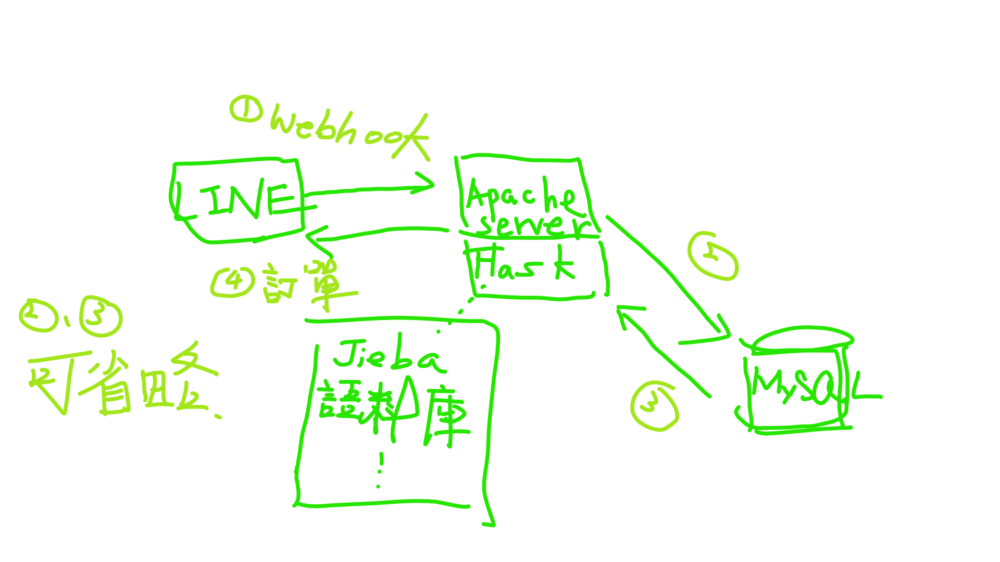
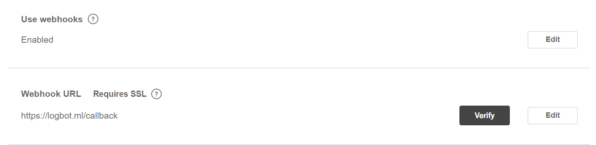

# LINE Bot FamilyMart Groupchat Order
作者: 呂佳奇  
時間: 2019-2-24

## 介紹
這篇文章主要說明 LINE Bot 回傳訂購紀錄的系統架構，涉及前後端的連結、訂購模型，以及未來建議的方向。  

實驗室伺服器: 140.115.157.80  
註冊域名: https://logbot.ml(限一年)  
登入帳號: root  
登入密碼: recast203  
___

## 系統架構
>基本上，LINE Bot 放在全家群組內，只要有文字或圖片訊息傳送到群組，就會觸發 Webhook，把訊息傳回實驗室伺服器，經過處理後，原始訊息以 JSON 格式儲存，根據往後系統需求，再與 MySQL 建立連線，把 JSON 資料插入進去。目前是以 Flask 接受原始訊息，並在此根據訊息特徵建立訂購模型，經過模型運算，找出購買行為，並回傳訂單記錄到 LINE 客戶端     

以下為系統架構圖:  

___
### LINE 客戶端
LINE Bot 被邀進全家群組，作為監視者。只要群組傳送訊息，就會觸發 [webhook](https://en.wikipedia.org/wiki/Webhook)，由 LINE 客戶端傳送 webhook event object 到指定的 webhook URLs 

### 伺服器
#### webhook event object
webhook event object 傳到伺服器，其實是一個 JSON 物件，官方文件有詳細的說明，可以去查看[常用資源](#常用資源)。
#### DNS & SSL 
實驗室域名由 [freenom](https://www.freenom.com/) 註冊，網路伺服器由 apache 架設，由於 webhook URLs 要求一定要經過 SSL 加密驗證，所以選用 [Let's Encrypt](https://letsencrypt.org/)

### Flask
Flask 充當網絡應用程式的角色。疊在 apache 網絡伺服器上，專門處理 webhook event object。
#### 儲存資料
webhook event object 傳送進伺服器以後， 以時間戳(timestamp) 為 key 值，按照時間序儲存訊息物件，包括傳送方姓名(display_name)、訊息類型(type)、訊息內容(message)。按每日儲存 JSON 檔案，例如 2019-01-02.json
#### 訂購模型
>使用 [Jieba 結巴中文切字套件](#常用資源)，抓出訊息的關鍵字  

模型分為購買行為、產品目錄、排除名單、保留名單  
**產品目錄**儲存過去出現過的產品關鍵字，即是 product_list.txt  
**購買行為**指定使用者購買的關鍵字，如"+1"、"加2"，出現在訊息中代表可能客戶有購買該產品的意圖，即是 plus.txt  
**排除名單**過濾不希望擷取的關鍵字，如"謝謝"、"來了"，即是 stop_words.txt     
**保留名單**強制模型擷取出該關鍵字，如"藍山咖啡"，不經指定會被分成"藍山"、"咖啡"，即是 userdict.txt   
#### 專案虛擬環境
使用 python 套件 virtualenv 來獨立管理專案環境，因為 ubuntu 系統底層使用大量 python2 的套件，如果不用虛擬環境，容易造成系統崩潰、異常
## 未來方向
1. 將 json 資料轉存進 MySQL，方便後續機器學習應用。
2. LINE 客戶端，開發選單，讓使用者自行選擇想要的服務，例如 "昨日購買紀錄"、"過去一個月的購買紀錄"
3. 請店長發布促銷活動前，先行在 LINE 客戶端輸入欲擷取的商品關鍵字，才能使模型準確判斷
4. 產品目錄(product_list.txt) 目前尚未有累積儲存功能，待開發。
___
## 常用資源
[LINE Bot SDK](https://github.com/line/line-bot-sdk-python)  
主要描述 flask 處理 webhook event object 的函數和方法，需要先預載。  
[LINE Messaging API](https://developers.line.biz/en/reference/messaging-api)  
詳細描述回傳的 webhook event objects，有各種不同語言的版本。  
[Jieba 中文分詞](https://github.com/fxsjy/jieba)  